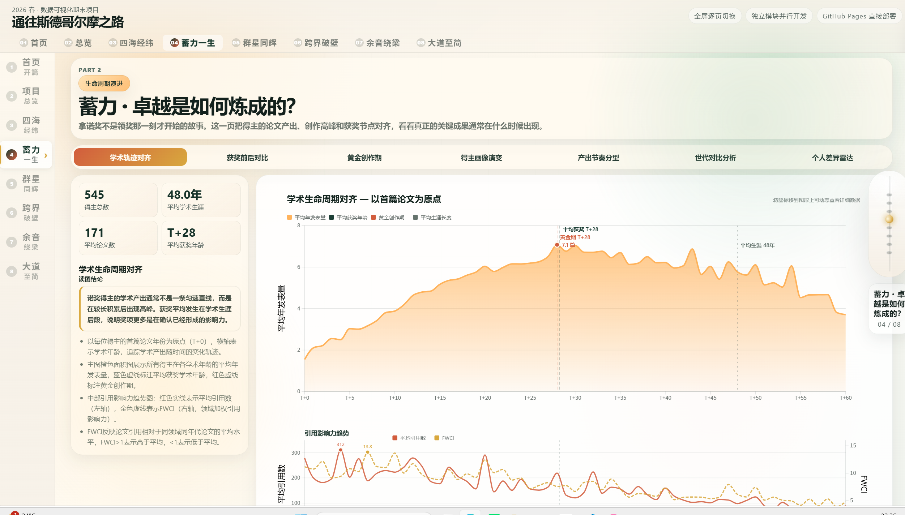
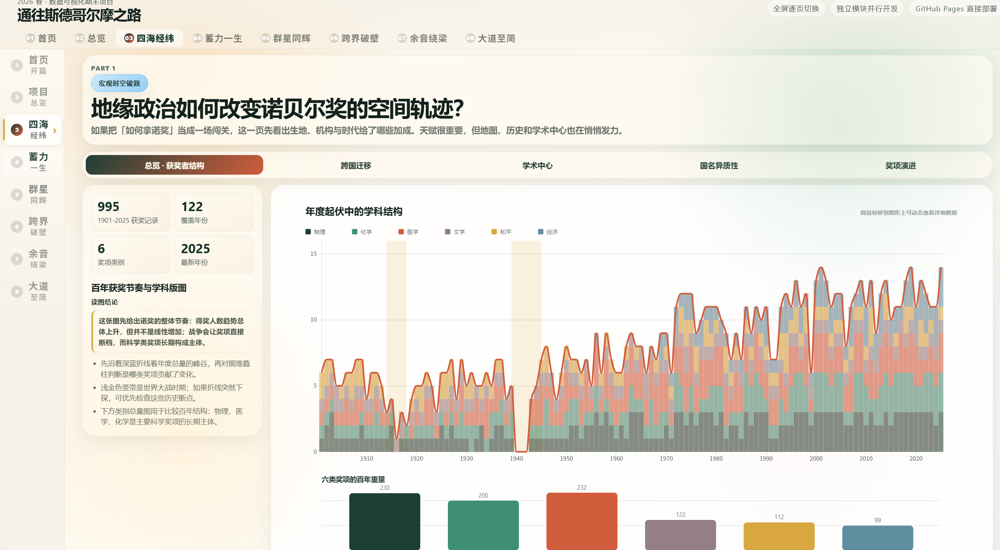
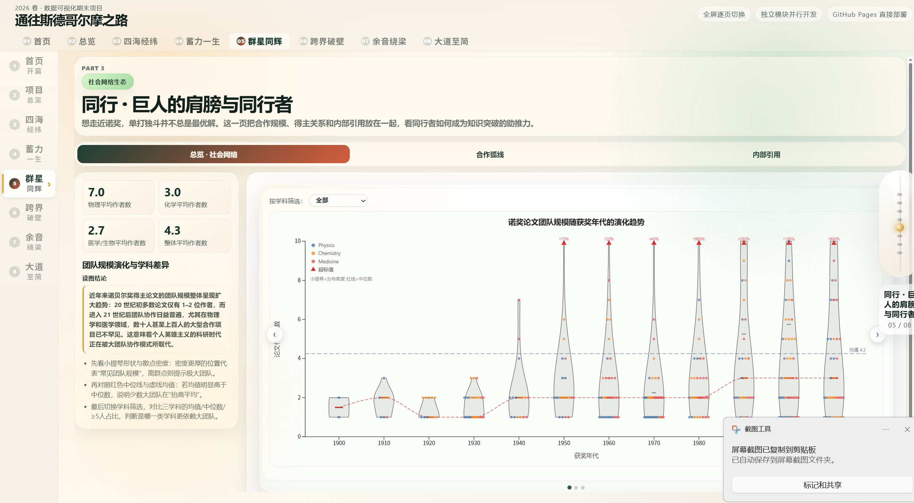
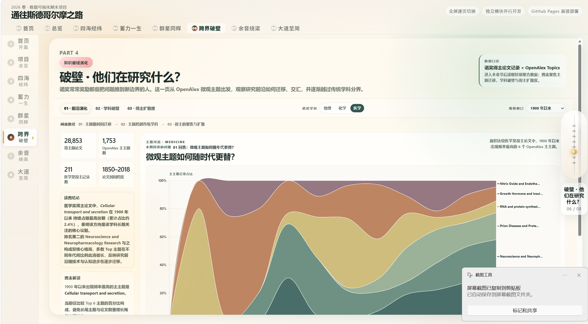
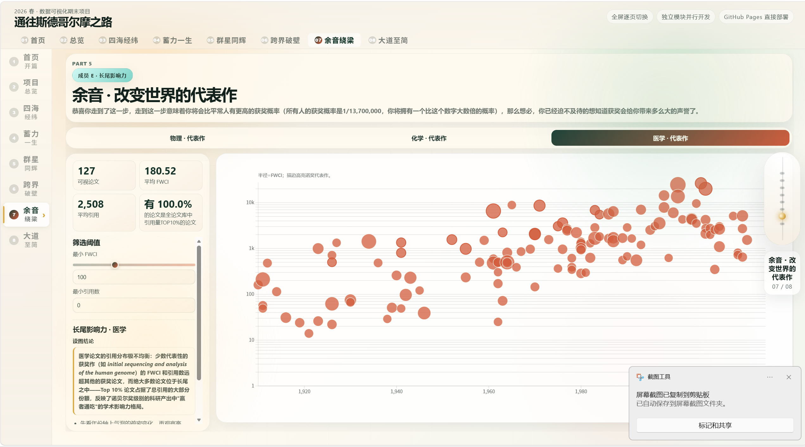
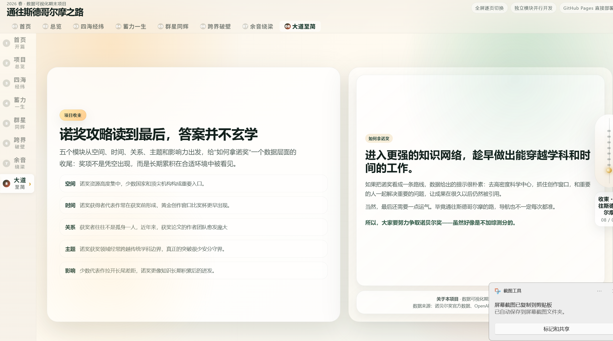

# 通往斯德哥尔摩之路

一个基于 **纯前端 HTML5 + CSS3 + ES6 JavaScript + D3.js v7** 的数据叙事可视化项目。作品以"通往斯德哥尔摩之路"为主题，探索诺贝尔奖得主的学术图谱与人生轨迹。它不是传统 dashboard，而是一篇全屏逐页式数据专题：读者通过右侧星轨翻页区域切换页面，在文字、轮播照片和 D3 交互图表之间理解荣誉背后的空间、时间、关系与知识结构。

## 项目展示

### 1. 封面：照片轮播与星轨翻页

项目以照片轮播建立叙事氛围，再进入项目总览与 5 个成员故事章节。读者可通过右侧星轨式翻页区域滚轮切换页面，也可使用键盘翻页。


### 2. 成员 A：谁在赢得诺贝尔奖？

第一章聚焦诺贝尔奖得主的宏观分布，通过时间序列展示获奖者的国籍、学科与年代变迁，揭示哪些国家与领域在历史长河中更受诺奖青睐。



### 3. 成员 B：蓄力——卓越是如何炼成的？

第二章关注获奖者的学术轨迹，从获奖年龄、教育背景、师承关系等维度，探索一位科学家从起步到登顶斯德哥尔摩的生命历程。



### 4. 成员 C：同行——巨人的肩膀与同行者

第三章搭建诺奖得主之间的合作网络，用节点与连线呈现学术共同体中"谁与谁合作""谁影响了谁"的隐性结构。



### 5. 成员 D：破壁——他们在研究什么？

第四章展示诺奖研究主题的流向与交叉，用带状图描绘学科之间的知识流动，揭示跨学科研究如何催生诺奖级成果。



### 6. 成员 E：余音——改变世界的代表作

第五章以散点图呈现诺奖得主论文的影响力分布，观察代表作的生命周期与被引轨迹，量化"改变世界"的学术回响。



### 7. 尾页：回到斯德哥尔摩

用总结页面收束全文叙事，将"谁获奖、如何蓄力、与谁同行、研究什么、留下什么"五条线索汇入同一幅画面，回应"通往斯德哥尔摩之路"的主题。



> **部署地址：** [https://xhrg2024.github.io/datavisualization/](https://xhrg2024.github.io/datavisualization/)

所有资源使用相对路径，无需打包工具，可直接部署。

## 功能亮点

- **全屏逐页式叙事**：页面通过星轨式翻页切换，不会出现滑动感，营造沉浸式阅读体验。
- **成员独立模块**：每位成员的故事页结构独立维护，互不干扰。
- **D3.js 图表交互**：支持折线图、散点图、网络图、带状图等多种可视化类型。
- **照片轮播**：首页使用轮播建立叙事氛围。
- **无需打包工具**：纯前端静态页面，直接通过 GitHub Pages 部署。
- **团队协作规范**：明确的分工结构和协作规范，便于多人并行开发。

## 技术栈

- HTML5
- CSS3
- ES6 JavaScript
- D3.js v7
- GitHub Pages

## 本地运行

直接用浏览器打开 `index.html` 即可预览，或使用本地服务器：

```bash
python serve_with_mime.py
```

也可以使用 Node.js 等工具启动本地服务器：

```bash
npx serve .
```

## 常用命令

```bash
git add .
git commit -m "提交说明"
git push origin main
```

## 数据来源

本项目使用本地 JSON 数据，包括但不限于：

| 模块 | 数据来源 | 用途 |
| --- | --- | --- |
| 成员 A | JSON 数据文件 | 宏观时间序列可视化 |
| 成员 B | JSON 数据文件 | 学术轨迹可视化 |
| 成员 C | JSON 数据文件 | 关系网络可视化 |
| 成员 D | JSON 数据文件 | 流向带状可视化 |
| 成员 E | JSON 数据文件 | 形态变换散点可视化 |

---

## 协作规范

1. `index.html` 只保留首页、项目总览和收束页，成员故事页结构由各自 `page.html` 决定。
2. 每位成员只修改自己的 `modules/memberX/` 目录（包括 `page.html`、`chart.js`、`style.css`）。
3. 成员页面的根节点必须保留 `.page` 与 `data-module`，并提供 `.chart-container` 或 `[data-chart-target]` 作为图表挂载点。
4. `main.js` 只负责加载模块页面与翻页控制，不干预成员页面内部布局。
5. 如果需要新增成员模块，复制 `modules/` 内的 `page.html` 模板并在 `main.js` 的 `moduleSpecs` 中注册。

技术栈只使用 HTML5、CSS3、ES6 JavaScript 和 D3.js v7。当前主页已经重构为全屏逐页式叙事：只有在右侧星轨式翻页区域滚轮或在键盘上翻页时才会切换页面，首页先用轮播建立氛围，再进入项目总览和 5 个成员故事章节。成员页面结构全部在 `modules/` 内维护。

## 项目结构

```text
project-root/
├── index.html             # 仅负责首页、项目总览、收束页与翻页壳
├── style.css              # 全局样式与翻页控件
├── main.js                # 负责加载各模块的独立页面
├── data/
│   ├── memberA_data.json
│   ├── memberB_data.json
│   ├── memberC_data.json
│   ├── memberD_data.json
│   └── memberE_data.json
└── modules/
    ├── memberA/
    │   ├── chart.js
    │   ├── page.html
    │   └── style.css
    ├── memberB/
    │   ├── chart.js
    │   ├── page.html
    │   └── style.css
    ├── memberC/
    │   ├── chart.js
    │   ├── page.html
    │   └── style.css
    ├── memberD/
    │   ├── chart.js
    │   ├── page.html
    │   └── style.css
    └── memberE/
        ├── chart.js
        ├── page.html
        └── style.css
```

## 主页结构

- 首页：照片轮播 + 项目氛围引导
- 项目总览：说明分工、节奏和协作方式
- 成员 A-E：各自独立的全屏故事页
- 收束页：项目总结与答辩出口

主页右侧的“星轨翻页”区域是唯一默认接收滚轮事件的区域，页面本体不会出现一点一点往下滑的感觉。


## 部署到 GitHub Pages

1. 将仓库推送到 GitHub。
2. 进入仓库的 Settings > Pages。
3. 选择 `Deploy from a branch`。
4. 分支选择 `main`，目录选择 `/root`。
5. 保存后等待 Pages 构建完成。

因为所有资源都使用相对路径，所以不需要额外打包工具，可以直接部署。

## 协作规范

1. `index.html` 只保留首页、项目总览和收束页，成员故事页结构由各自 `page.html` 决定。
2. 每位成员只修改自己的 `modules/memberX/` 目录（包括 `page.html`、`chart.js`、`style.css`）。
3. 成员页面的根节点必须保留 `.page` 与 `data-module`，并提供 `.chart-container` 或 `[data-chart-target]` 作为图表挂载点。
4. `main.js` 只负责加载模块页面与翻页控制，不干预成员页面内部布局。
5. 如果需要新增成员模块，复制 `modules/` 内的 `page.html` 模板并在 `main.js` 的 `moduleSpecs` 中注册。

## 当前示例图表

为了让项目先跑起来并便于判断视觉方向，仓库里已经放入了 5 个可运行的示例图表：

- 宏观时间序列图
- 学术轨迹图
- 关系网络图
- 流向带状图
- 形态变换散点图

这些图表都基于本地 JSON 数据，可以直接替换成团队自己的真实数据。

## 开发建议

1. 先由每位成员在自己的模块里替换示例数据和图形逻辑。
2. 保持图表类接口一致，至少提供 `loadData()` 和 `resize()`。
3. 如果某个模块需要更多联动状态，可以继续扩展 `d3.dispatch` 的事件类型。
4. 提交前先用浏览器检查滚动联动和响应式布局在桌面端、平板端和移动端的表现。